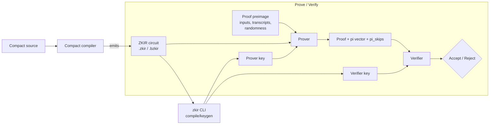
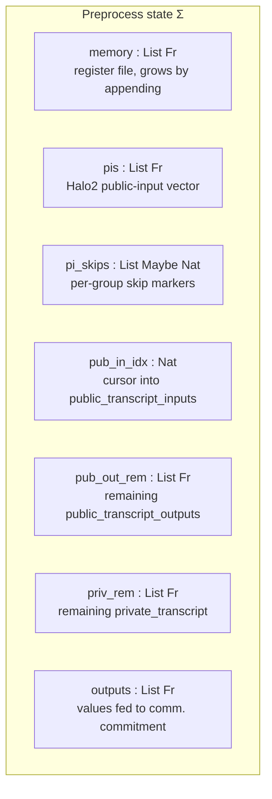
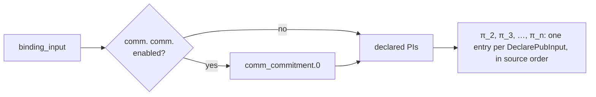

# ZKIR v2 — Language Specification

**Status:** Working draft.
**Source of truth:** the Rust implementation in [midnight-ledger/zkir/src/](https://github.com/midnightntwrk/midnight-ledger/tree/ledger-8/zkir/src), in particular [ir.rs](https://github.com/midnightntwrk/midnight-ledger/blob/ledger-8/zkir/src/ir.rs) and [ir_vm.rs](https://github.com/midnightntwrk/midnight-ledger/blob/ledger-8/zkir/src/ir_vm.rs).
**Mechanisation:** a machine-checked Agda formalisation of §4–§6 accompanies this spec in [src/zkir-v2/](../src/zkir-v2/). The preprocess semantics (§4), the constraint-emission contracts (§5.2), the producer obligations (§6.4), and — as of this draft — the faithfulness bridge **Property P5** (§6.2) are all mechanised, modulo a cryptographic trust base; see P5's status note for scope.
**Versions covered:** ZKIR major version 2, minor versions V0 and V1. V1 is canonical; V0 is described in Appendix A.

This document specifies ZKIR v2: the abstract syntax, concrete (JSON and tagged-binary) representations, the witness-population (*preprocess*) semantics, the Halo2 *circuit* semantics, the relationship between the two, the security and correctness properties expected of an implementation, and the use-case patterns that motivated the language's design.

**Normative vs informative.** Sections are *normative* (part of the language definition that an implementation must conform to) unless explicitly marked *(informative)*. Informative sections describe the current implementation but do not constrain conforming implementations — they may change without a language-version bump. Sections that are wholly informative are flagged on their headings; mixed sections call out informative sub-parts inline.

It is structured for three audiences:

- **Circuit authors and Compact compiler engineers** can read sections 1–3 and the instruction-reference tables in §4.3 as a practical language reference.
- **PL / formal-methods readers** can additionally read §4.4 (small-step rules), §5 (circuit semantics), and §6 (properties) for a precise definition.
- **Cryptographers** will find §5.4 (public-input layout, binding input, communications commitment) and §6.2 (soundness obligations) most relevant.

---

## Table of contents

1. [Introduction](#1-introduction)
2. [Overview](#2-overview)
3. [Syntax](#3-syntax)
4. [Preprocess semantics](#4-preprocess-semantics)
5. [Circuit semantics](#5-circuit-semantics)
6. [Properties](#6-properties)
7. [Use-case patterns](#7-use-case-patterns)
8. [Limitations and motivation for v3](#8-limitations-and-motivation-for-v3)
9. [Appendix A — V0 legacy semantics](#appendix-a--v0-legacy-semantics)
10. [Appendix B — Glossary](#appendix-b--glossary)

---

## 1. Introduction

### 1.1 What ZKIR is

ZKIR ("zero-knowledge intermediate representation") is the low-level circuit description language that Midnight's Compact contract compiler emits and that Midnight's Halo2/PLONK-based proof system consumes. A ZKIR circuit is a linear, untyped sequence of small primitive instructions over a single field-element register file, with a fixed set of side-effect channels (transcripts, public-input vector, communications commitment).

ZKIR plays two distinct roles, both expressed by the same source:

- as a **witness-population programme** — given a *proof preimage* (inputs, transcripts, randomness), the circuit is executed forward to populate the register file, derive the public-input vector, and verify constraint side-conditions;
- as a **constraint-system blueprint** — the same instructions are lowered to a Halo2 constraint system whose satisfying witnesses are exactly the values populated by the first reading.

The whole point of the language is that these two readings agree: the prover can succeed if and only if the witness-population programme succeeds without violating any constraint. This agreement is **Property P5** (§6.2), which is mechanised in the accompanying Agda formalisation ([src/zkir-v2/](../src/zkir-v2/)).

### 1.2 Where ZKIR sits *(informative)*



The `zkir` binary ([main.rs](https://github.com/midnightntwrk/midnight-ledger/blob/ledger-8/zkir/src/main.rs)) compiles a `.zkir` (JSON) or `.bzkir` (tagged binary) source into a prover/verifier key pair. At runtime the proof preimage is supplied by the protocol layer (Zswap, Dust, the contract runtime); the prover executes preprocess, hands the witness to the Halo2 backend, and produces a proof together with the public-input vector that the verifier reconstructs from the public transcript.

### 1.3 Design philosophy

ZKIR v2 takes a deliberately minimal, register-machine view of circuits.

- **Unityped, untyped, single-assignment.** Every value is a BLS12-381 scalar (`Fr`). Operands are non-negative indices (`u32`) into a *memory* whose i-th cell is bound exactly once by the instruction that produced it. There are no named variables, no type annotations, no scopes.
- **No structured control flow.** The instruction stream is straight-line. Conditional behaviour is expressed by computing a boolean and threading it through `CondSelect`, guarded transcript reads, and guarded `PiSkip` markers.
- **Witness-first.** The semantics is given by a forward execution that produces a satisfying witness; constraint emission is derived from it. Instructions whose precondition implies undefined behaviour (UB) are not a separate failure mode at the language level — they merely make the resulting constraint system unsatisfiable on inputs that would have triggered them in preprocess.
- **Thin layer over `ZkStdLib`.** Each instruction corresponds, roughly, to one chip call in the `midnight-zk` standard library. ZKIR exposes only a subset of that library; widening this surface is the central motivation for v3 (see §8).

### 1.4 Versioning

The major version is 2. Two minor versions exist:

- **V0** — the original v2 release. Bit-bound constraints are enforced by explicit little-endian bit decomposition in-circuit.
- **V1** — the current default ([IrMinorVersion::V1](https://github.com/midnightntwrk/midnight-ledger/blob/ledger-8/zkir/src/ir.rs)). Functionally identical to V0 at the preprocess level (the same witnesses are produced and the same constraints are *semantically* enforced) but with optimised Halo2 lowerings for `CondSelect`, `ConstrainBits`, and `ReconstituteField`, and a larger number of `pow2range` columns. The intended correctness statement (Property P6, §6) is that the satisfying-witness sets of V0 and V1 coincide.

This document specifies V1. V0 differences live in [Appendix A](#appendix-a--v0-legacy-semantics).

### 1.5 Conventions

- `Fr` denotes the BLS12-381 scalar field. `FR_BITS = 255`. `0` and `1` denote the field's additive and multiplicative identities; we identify booleans with `{0, 1} ⊂ Fr`.
- "Memory" always means the register file `M : Fr*` introduced in §4.1.
- Indices into `M` are `u32` values, treated mathematically as natural numbers.
- We write `M[i]` for the i-th memory cell, `xs ++ ys` for list concatenation, `xs[k:]` and `xs[:k]` for the obvious slicing operations.
- "UB" stands for *undefined behaviour* — a precondition the language assumes the producer of the circuit has discharged. See §4.6.

---

## 2. Overview

### 2.1 An `IrSource` at a glance

A ZKIR circuit is a record:

```
IrSource = {
  version                       : IrMinorVersion,
  num_inputs                    : u32,
  do_communications_commitment  : bool,
  instructions                  : List Instruction,
}
```

The smallest non-trivial example, drawn from [test_minimal_proof](https://github.com/midnightntwrk/midnight-ledger/blob/ledger-8/zkir/tests/proofs.rs):

```json
{
  "version": { "major": 2, "minor": 0 },
  "num_inputs": 1,
  "do_communications_commitment": false,
  "instructions": [
    { "op": "assert", "cond": 0 }
  ]
}
```

This circuit accepts exactly one input cell `M[0]` and asserts that it equals `1`. The empty public transcript means no value other than the binding input is publicly bound. (The JSON uses minor `0` because that is the format-level minimum the loader recognises; the *preprocess* semantics does not depend on the minor field, but the in-circuit lowering does — see §1.4.)

### 2.2 Execution model

At runtime the prover holds the following state (a *preprocess state*):



Each instruction is a transition over this state. The proof preimage supplies three streams:

- `inputs : List Fr` — initial contents of `memory`. Length must equal `num_inputs`.
- `public_transcript_outputs : List Fr` — public values the circuit *consumes* (e.g. on-chain state read by the contract). `PublicInput` reads from this stream.
- `private_transcript : List Fr` — prover-private witness values. `PrivateInput` reads from this stream.

And two pieces of bound metadata:

- `binding_input : Fr` — always the first entry of `pis`. Binds the proof to an external context (typically a transaction-level hash).
- `communications_commitment : Option (Fr × Fr)` — present iff `do_communications_commitment`. The first component is the second entry of `pis`; the second is the randomness used inside the circuit (see §4.5, §5.4).

The circuit *produces* a fourth stream implicitly: the values declared via `DeclarePubInput`, which are appended to `pis` and (modulo skip markers) checked against the verifier's expected `public_transcript_inputs`.

### 2.3 Instruction catalogue

The 26 instructions fall into nine categories:

| Category | Instructions |
|---|---|
| Arithmetic (field) | `add`, `mul`, `neg` |
| Boolean / comparison | `not`, `test_eq`, `less_than` |
| Constants & copy | `load_imm`, `copy` |
| Control | `cond_select` |
| Constraints | `assert`, `constrain_eq`, `constrain_to_boolean`, `constrain_bits` |
| Bit/field manipulation | `div_mod_power_of_two`, `reconstitute_field` |
| Elliptic curve (Jubjub) | `ec_add`, `ec_mul`, `ec_mul_generator`, `hash_to_curve` |
| Hashing | `transient_hash`, `persistent_hash` |
| Transcript I/O & PIs | `public_input`, `private_input`, `declare_pub_input`, `pi_skip` |
| Commitment sink | `output` |

A full reference is in §4.3.

---

## 3. Syntax

### 3.1 Abstract syntax

We use the following grammar. `ℕ` denotes natural numbers (the source-level `u32` and bit-counts); `Fr` denotes a BLS12-381 scalar; `Alignment` denotes a *field-aligned binary* alignment descriptor, defined externally in [base_crypto::fab](https://github.com/midnightntwrk/midnight-ledger/tree/ledger-8/base-crypto) and treated abstractly here.

```
Index           ::= ℕ                                       — register index (u32)

IrMinorVersion  ::= V0 | V1

IrSource        ::= ⟨ version : IrMinorVersion,
                       num_inputs : ℕ,
                       do_communications_commitment : 𝔹,
                       instructions : [ Instruction ] ⟩

Instruction     ::=
  | Assert              cond : Index
  | CondSelect          bit : Index, a : Index, b : Index
  | ConstrainBits       var : Index, bits : ℕ
  | ConstrainEq         a : Index, b : Index
  | ConstrainToBoolean  var : Index
  | Copy                var : Index
  | DeclarePubInput     var : Index
  | PiSkip              guard : Option Index, count : ℕ
  | EcAdd               a_x : Index, a_y : Index, b_x : Index, b_y : Index
  | EcMul               a_x : Index, a_y : Index, scalar : Index
  | EcMulGenerator      scalar : Index
  | HashToCurve         inputs : [ Index ]
  | LoadImm             imm : Fr
  | DivModPowerOfTwo    var : Index, bits : ℕ
  | ReconstituteField   divisor : Index, modulus : Index, bits : ℕ
  | Output              var : Index
  | TransientHash       inputs : [ Index ]
  | PersistentHash      alignment : Alignment, inputs : [ Index ]
  | TestEq              a : Index, b : Index
  | Add                 a : Index, b : Index
  | Mul                 a : Index, b : Index
  | Neg                 a : Index
  | Not                 a : Index
  | LessThan            a : Index, b : Index, bits : ℕ
  | PublicInput         guard : Option Index
  | PrivateInput        guard : Option Index
```

### 3.2 Concrete JSON representation

`IrSource` serialises to a JSON object. The `version` field at the JSON level uses `{ "major": 2, "minor": M }`; the loader [`IrSource::load`](https://github.com/midnightntwrk/midnight-ledger/blob/ledger-8/zkir/src/ir.rs) accepts `major: 2, minor ∈ {0, 1}` and normalises the value internally.

Each instruction is tagged by an `op` field whose value is the snake-case form of the variant name. Field names match the abstract syntax. Field elements (`imm`) are encoded as lowercase little-endian hex strings, optionally prefixed with `-` to negate; trailing zero bytes are stripped.

The minimal example from §2.1 is representative. A more involved one, from [zswap/output.zkir](https://github.com/midnightntwrk/midnight-ledger/blob/ledger-8/zkir-precompiles/zswap/output.zkir):

```json
{ "op": "load_imm", "imm": "00" }
{ "op": "load_imm", "imm": "01" }
{ "op": "cond_select", "bit": 0, "a": 11, "b": 12 }
{ "op": "persistent_hash",
  "alignment": [ { "tag": "atom",
                   "value": { "length": 21, "tag": "bytes" } } ],
  "inputs": [16, 5, 6, 7, 8, 9, 0, 14, 15] }
{ "op": "pi_skip", "guard": 12, "count": 4 }
```

### 3.3 Tagged binary representation

For on-disk distribution, ZKIR uses a *tagged* binary format (the `.bzkir` extension) defined by the [`serialize`](https://github.com/midnightntwrk/midnight-ledger/tree/ledger-8/serialize) crate. The format prepends a structural tag so that the deserialiser can refuse to interpret data of the wrong shape.

The current tag for an `IrSource` is `"ir-source[v2-generic]"`. A legacy tag, `"ir-source[v2]"`, is accepted on input for V0-only sources that predate the explicit minor-version field; it is mapped to V0 (see Appendix A). On output, V0 sources are emitted under the legacy tag for binary compatibility.

The corresponding tags for derived artefacts are:

| Artefact | Tag |
|---|---|
| `IrSource` (V0/V1) | `ir-source[v2-generic]` |
| `IrSource` (legacy V0) | `ir-source[v2]` |
| `Instruction` | `ir-instruction[v2]` |
| `IrMinorVersion` | `ir-minor-version[v2]` |
| `ProverKey<IrSource>` | `prover-key[v7](ir-source[v2])` |

### 3.4 Well-formedness

An `IrSource` is *well-formed* iff the following structural conditions hold. They are necessary preconditions for the semantic accounts in §4 and §5 to be defined; they are *not* by themselves sufficient for preprocess success, which additionally depends on the preimage.

- **WF1 — input arity.** `num_inputs` equals the length of `preimage.inputs` at runtime (this is checked dynamically in [ir_vm.rs](https://github.com/midnightntwrk/midnight-ledger/blob/ledger-8/zkir/src/ir_vm.rs); the well-formed shape requires that the producer knows this length).
- **WF2 — bit bounds.** Bit-count fields are bounded per-instruction. With `FR_BITS = 255` and `FR_BYTES_STORED = 31` (BLS12-381 scalar field):
  - `ConstrainBits { bits }` and `LessThan { bits }`: `bits < FR_BITS` (i.e. `bits ≤ 254`). The Rust preprocess [helper `idx_bits`](https://github.com/midnightntwrk/midnight-ledger/blob/ledger-8/zkir/src/ir_vm.rs) rejects `bits ≥ FR_BITS` with "Excessive bit bound".
  - `DivModPowerOfTwo { bits }` and `ReconstituteField { bits }`: `bits ≤ FR_BYTES_STORED · 8` (i.e. `bits ≤ 248`). The Rust preprocess rejects `bits > FR_BYTES_STORED · 8` with "Excessive bit count".
  - `ReconstituteField { bits }` additionally requires `bits ≥ 1` (otherwise the dual bound `FR_BITS - bits = FR_BITS` is excessive).
- **WF3 — `PiSkip` discipline.** Every `DeclarePubInput` instruction must be *covered* by a subsequent `PiSkip` whose `count` accounts for it. Concretely, in the sequence of instructions, the sum of `count`s of all `PiSkip`s must equal the number of `DeclarePubInput`s, and no `PiSkip` may cover more `DeclarePubInput`s than have been emitted since the previous `PiSkip`. This is a structural condition decidable by a single linear scan over the instruction stream; the algorithm is given as producer obligation [O1](#o1--piskip-discipline) in §6.4. The runtime itself does not check WF3 directly; violations surface as transcript-mismatch failures (see §4.5).

Indices that point past the current memory size are not a well-formedness violation in the abstract syntax — they manifest as runtime preprocess failures (rule `mem-lookup-fail`). Producers are expected to maintain the invariant statically.

---

## 4. Preprocess semantics

### 4.1 State and notation

Let

```
Σ = ⟨ M       : Fr*,           -- memory
      π       : Fr*,           -- pis (Halo2 public-input vector)
      κ       : (Option ℕ)*,   -- pi_skips (per-group active/skipped markers)
      ι       : ℕ,             -- pub_in_idx, cursor over preimage.public_transcript_inputs
      τ⁺      : Fr*,           -- remaining preimage.public_transcript_outputs
      τ⁻      : Fr*,           -- remaining preimage.private_transcript
      ω       : Fr* ⟩           -- outputs (fed to communications commitment)
```

The preimage `P` provides
```
P.inputs                  : Fr*,
P.binding_input           : Fr,
P.comm_commitment         : Option (Fr × Fr),
P.public_transcript_inputs  : Fr*,
P.public_transcript_outputs : Fr*,
P.private_transcript      : Fr*.
```

We write `Σ |= ι` to mean "instruction `ι` is enabled in `Σ`" and `P ⊢ Σ ─ι→ Σ'` for the one-step transition. The semantics is *partial*: an instruction either has a unique successor state, or *fails* (the rule has no successor for these premises; modelled as `nothing` in `Maybe`-style semantics). Failure is an expected outcome — it is how the language signals "this preimage does not satisfy this circuit." It is not a pathology of the abstract machine; *stuck-state* terminology from soundness-of-type-systems vocabulary would be a misnomer.

We use the following helpers in rules:

- `M[i]` — the i-th element of `M` (defined only if `i < |M|`).
- `bool(v)` — `false` if `v = 0`, `true` if `v = 1`, undefined otherwise.
- `χ(b) ∈ Fr` — the field embedding of a boolean: `χ(false) = 0`, `χ(true) = 1`.
- `bits(v, n) : 𝔹*` — the little-endian bit representation of `v` truncated to `n` bits, defined only when `v < 2^n` (otherwise the constraint fails).
- `bits(v) : 𝔹*` — the LE bit representation of `v` to `FR_BITS` bits, always defined.
- `eval-guard(M, g)` — `true` if `g = nothing`; `bool(M[i])` if `g = some i`. Undefined (i.e. the surrounding instruction fails) if either lookup fails or the value is not a boolean.

### 4.2 Initialisation

Given source `S` and preimage `P`, define

```
init(S, P) =
  if |P.inputs| ≠ S.num_inputs       then fail
  else if S.do_communications_commitment
                              then
    case P.comm_commitment of
      some (c, _) → ⟨ P.inputs, [P.binding_input, c], [], 0, P.pub-out, P.priv, [] ⟩
      nothing     → fail
  else
    ⟨ P.inputs, [P.binding_input], [], 0, P.pub-out, P.priv, [] ⟩
```

where `P.pub-out` and `P.priv` abbreviate the public-output and private transcripts. Note that the binding input is *always* present as the first PI; the communications commitment value, if requested, is the second.

### 4.3 Instruction reference (tabular)

The following table is a one-line-per-instruction summary of preconditions and effects. The "Δmem" column gives the number of new memory cells appended. Side-effect channels are abbreviated `π` (pis), `κ` (pi_skips), `ι` (pub_in_idx), `τ⁺` (pub_out_rem), `τ⁻` (priv_rem), `ω` (outputs).

| Instruction | Preconditions | Effect | Δmem | Side effects |
|---|---|---|---|---|
| `assert(c)` | `bool(M[c]) = true` | — | 0 | — |
| `cond_select(b, a, c)` | `bool(M[b]) ∈ {false,true}` | append `M[a]` if `bool(M[b])`, else `M[c]` | 1 | — |
| `constrain_bits(v, n)` | `M[v] < 2^n` | — | 0 | — |
| `constrain_eq(a, b)` | `M[a] = M[b]` | — | 0 | — |
| `constrain_to_boolean(v)` | `M[v] ∈ {0, 1}` | — | 0 | — |
| `copy(v)` | — | append `M[v]` | 1 | — |
| `declare_pub_input(v)` | — | — | 0 | `π ← π ++ [M[v]]`, `ι ← ι + 1` |
| `pi_skip(g, n)` | see §4.5 | — | 0 | `κ ← κ ++ […]`; if guard false, `ι ← ι − n` |
| `ec_add(a_x,a_y,b_x,b_y)` | `(M[a_x],M[a_y])`, `(M[b_x],M[b_y])` on Jubjub | append `(c_x, c_y)` of point sum | 2 | — |
| `ec_mul(a_x,a_y,s)` | `(M[a_x],M[a_y])` on Jubjub | append `(c_x, c_y) = M[s] · (M[a_x],M[a_y])` | 2 | — |
| `ec_mul_generator(s)` | — | append `(c_x, c_y) = M[s] · G` | 2 | — |
| `hash_to_curve(I)` | — | append `(c_x, c_y) = H2C(M[I])` | 2 | — |
| `load_imm(k)` | — | append `k` | 1 | — |
| `div_mod_power_of_two(v, n)` | `n ≤ FR_BYTES_STORED · 8` | append `(M[v] >> n)`, `(M[v] mod 2^n)` | 2 | — |
| `reconstitute_field(d, m, n)` | `1 ≤ n ≤ FR_BYTES_STORED · 8`, `M[m] < 2^n`, `M[d] < 2^(FR_BITS − n)`, `M[d] · 2^n + M[m] < \|Fr\|` | append `M[d] · 2^n + M[m]` | 1 | — |
| `output(v)` | — | — | 0 | `ω ← ω ++ [M[v]]` |
| `transient_hash(I)` | — | append `H_T(M[I])` | 1 | — |
| `persistent_hash(α, I)` | `M[I]` matches `α` | append `h₁ = SHA-256(bytes_α(M[I]))[31]`, then `h₂ = ∑_{i=0}^{30} 2^{8i} · SHA-256(bytes_α(M[I]))[i]` | 2 | — |
| `test_eq(a, b)` | — | append `χ(M[a] = M[b])` | 1 | — |
| `add(a, b)` | — | append `M[a] + M[b]` | 1 | — |
| `mul(a, b)` | — | append `M[a] · M[b]` | 1 | — |
| `neg(a)` | — | append `−M[a]` | 1 | — |
| `not(a)` | `bool(M[a]) ∈ {false,true}` | append `χ(¬bool(M[a]))` | 1 | — |
| `less_than(a, b, n)` | `M[a] < 2^n`, `M[b] < 2^n` | append `χ(M[a] < M[b])` | 1 | — |
| `public_input(g)` | guard well-typed; `τ⁺` non-empty if active | append next of `τ⁺` (or `0` if inactive) | 1 | possibly `τ⁺ ← τ⁺[1:]` |
| `private_input(g)` | guard well-typed; `τ⁻` non-empty if active | append next of `τ⁻` (or `0` if inactive) | 1 | possibly `τ⁻ ← τ⁻[1:]` |

`H_T`, `H_P`, and `H2C` are the transient (Poseidon-based), persistent (SHA-256-based with FAB decoding), and hash-to-curve primitives from [transient_crypto::hash](https://github.com/midnightntwrk/midnight-ledger/tree/ledger-8/transient-crypto). `G` is the Jubjub group generator.

### 4.4 Small-step rules

For brevity we write `Σ = ⟨M, π, κ, ι, τ⁺, τ⁻, ω⟩`. Each rule's premises must hold for the transition to be defined; if any premise is unmet the instruction *fails* and `preprocess` returns no continuation. The notation `M; v` abbreviates `M ++ [v]`, and `M; u; v` abbreviates `M ++ [u, v]`.

#### Arithmetic and boolean

$$
\dfrac{M[a] = u \quad M[b] = v}
      {P \vdash \Sigma \;\xrightarrow{\mathrm{add}(a,b)}\; \langle M; u + v,\ \pi,\ \kappa,\ \iota,\ \tau^+,\ \tau^-,\ \omega\rangle}
$$

$$
\dfrac{M[a] = u \quad M[b] = v}
      {P \vdash \Sigma \;\xrightarrow{\mathrm{mul}(a,b)}\; \langle M; u \cdot v,\ \ldots\rangle}
$$

$$
\dfrac{M[a] = u}
      {P \vdash \Sigma \;\xrightarrow{\mathrm{neg}(a)}\; \langle M; -u,\ \ldots\rangle}
$$

$$
\dfrac{M[a] = u \quad \mathrm{bool}(u) = b}
      {P \vdash \Sigma \;\xrightarrow{\mathrm{not}(a)}\; \langle M; \chi(\neg b),\ \ldots\rangle}
$$

$$
\dfrac{M[a] = u \quad M[b] = v}
      {P \vdash \Sigma \;\xrightarrow{\mathrm{test\_eq}(a,b)}\; \langle M; \chi(u = v),\ \ldots\rangle}
$$

$$
\dfrac{M[a] = u \quad M[b] = v \quad u < 2^n \quad v < 2^n}
      {P \vdash \Sigma \;\xrightarrow{\mathrm{less\_than}(a,b,n)}\; \langle M; \chi(u < v),\ \ldots\rangle}
$$

#### Constants and copy

$$
\dfrac{}
      {P \vdash \Sigma \;\xrightarrow{\mathrm{load\_imm}(k)}\; \langle M; k,\ \ldots\rangle}
$$

$$
\dfrac{M[v] = u}
      {P \vdash \Sigma \;\xrightarrow{\mathrm{copy}(v)}\; \langle M; u,\ \ldots\rangle}
$$

#### Constraints

$$
\dfrac{M[c] = u \quad \mathrm{bool}(u) = \mathrm{true}}
      {P \vdash \Sigma \;\xrightarrow{\mathrm{assert}(c)}\; \Sigma}
$$

$$
\dfrac{M[a] = u \quad M[b] = v \quad u = v}
      {P \vdash \Sigma \;\xrightarrow{\mathrm{constrain\_eq}(a,b)}\; \Sigma}
$$

$$
\dfrac{M[v] = u \quad u \in \{0, 1\}}
      {P \vdash \Sigma \;\xrightarrow{\mathrm{constrain\_to\_boolean}(v)}\; \Sigma}
$$

$$
\dfrac{M[v] = u \quad u < 2^n}
      {P \vdash \Sigma \;\xrightarrow{\mathrm{constrain\_bits}(v,n)}\; \Sigma}
$$

#### Control

$$
\dfrac{M[b] = u \quad \mathrm{bool}(u) = \mathrm{true} \quad M[a] = v_a}
      {P \vdash \Sigma \;\xrightarrow{\mathrm{cond\_select}(b,a,c)}\; \langle M; v_a,\ \ldots\rangle}
\qquad
\dfrac{M[b] = u \quad \mathrm{bool}(u) = \mathrm{false} \quad M[c] = v_c}
      {P \vdash \Sigma \;\xrightarrow{\mathrm{cond\_select}(b,a,c)}\; \langle M; v_c,\ \ldots\rangle}
$$

#### Bit and field manipulation

$$
\dfrac{M[v] = u \quad n \leq \mathit{FR\_BYTES\_STORED} \cdot 8}
      {P \vdash \Sigma \;\xrightarrow{\mathrm{div\_mod\_power\_of\_two}(v,n)}\; \langle M;\ \lfloor u / 2^n \rfloor;\ u \bmod 2^n,\ \ldots\rangle}
$$

Note that the natural-number `⌊u / 2^n⌋` is well-defined for any `u : Fr` because `u` is canonically represented in `[0, |Fr|)`; the rule treats `u` as that representative.

$$
\dfrac{M[d] = u_d \quad M[m] = u_m \quad 1 \leq n \leq \mathit{FR\_BYTES\_STORED} \cdot 8 \quad u_m < 2^n \quad u_d < 2^{\mathit{FR\_BITS} - n} \quad u_d \cdot 2^n + u_m < |Fr|}
      {P \vdash \Sigma \;\xrightarrow{\mathrm{reconstitute\_field}(d,m,n)}\; \langle M; u_d \cdot 2^n + u_m,\ \ldots\rangle}
$$

The final premise `u_d · 2^n + u_m < |Fr|` is the *no-field-overflow* condition: the bit-bound premises alone admit values up to `2^FR_BITS - 1 > |Fr| - 1`, so a strict inequality against the field order is required. Note that the V1 in-circuit lowering (§5.2) does *not* emit this check — it relies on the producer ensuring that overflow cannot occur. See §6.3 for the soundness consequences.

#### Elliptic curve (Jubjub)

Let `J` denote the Jubjub embedded curve over `Fr`, with affine coordinates `(x, y)` and group generator `G`. Group operations `+_J` and scalar multiplication `·_J` are those of `J`.

$$
\dfrac{
  M[a_x] = x_a \ \ M[a_y] = y_a \ \
  M[b_x] = x_b \ \ M[b_y] = y_b \ \
  (x_a, y_a) \in J \ \ (x_b, y_b) \in J \ \
  (x_a, y_a) +_J (x_b, y_b) = (x_c, y_c)
}{P \vdash \Sigma \;\xrightarrow{\mathrm{ec\_add}(a_x,a_y,b_x,b_y)}\; \langle M; x_c; y_c,\ \ldots\rangle}
$$

$$
\dfrac{
  M[a_x] = x_a \ \ M[a_y] = y_a \ \ M[s] = k \ \
  (x_a, y_a) \in J \ \
  k \cdot_J (x_a, y_a) = (x_c, y_c)
}{P \vdash \Sigma \;\xrightarrow{\mathrm{ec\_mul}(a_x,a_y,s)}\; \langle M; x_c; y_c,\ \ldots\rangle}
$$

$$
\dfrac{M[s] = k \quad k \cdot_J G = (x_c, y_c)}
      {P \vdash \Sigma \;\xrightarrow{\mathrm{ec\_mul\_generator}(s)}\; \langle M; x_c; y_c,\ \ldots\rangle}
$$

$$
\dfrac{(\forall i)\ M[I_i] = v_i \quad H2C(v_0, \ldots, v_{|I|-1}) = (x_c, y_c)}
      {P \vdash \Sigma \;\xrightarrow{\mathrm{hash\_to\_curve}(I)}\; \langle M; x_c; y_c,\ \ldots\rangle}
$$

#### Hashing

$$
\dfrac{(\forall i)\ M[I_i] = v_i}
      {P \vdash \Sigma \;\xrightarrow{\mathrm{transient\_hash}(I)}\; \langle M; H_T(\vec v),\ \ldots\rangle}
$$

$$
\dfrac{(\forall i)\ M[I_i] = v_i \quad b = \mathrm{bytes}_\alpha(\vec v) \quad d = \mathrm{SHA\_256}(b) \quad h_1 = d_{31} \quad h_2 = \sum_{i=0}^{30} 2^{8i} \cdot d_i}
      {P \vdash \Sigma \;\xrightarrow{\mathrm{persistent\_hash}(\alpha, I)}\; \langle M; h_1; h_2,\ \ldots\rangle}
$$

`bytes_α(v⃗)` denotes the byte sequence produced by decoding the field-element vector `v⃗` under FAB alignment `α`. If `v⃗` does not validly decode under `α` the instruction fails. The cell ordering matches the in-circuit lowering: the first appended cell holds the high-order byte of the SHA-256 digest, and the second holds the remaining 31 bytes assembled as a little-endian field element.

#### Transcripts and outputs

Let `eg = eval-guard(M, g)`.

$$
\dfrac{eg = \mathrm{true} \quad \tau^- = w :: \tau^{-\prime}}
      {P \vdash \Sigma \;\xrightarrow{\mathrm{private\_input}(g)}\; \langle M; w,\ \pi,\ \kappa,\ \iota,\ \tau^+,\ \tau^{-\prime},\ \omega\rangle}
\qquad
\dfrac{eg = \mathrm{false}}
      {P \vdash \Sigma \;\xrightarrow{\mathrm{private\_input}(g)}\; \langle M; 0,\ \ldots\rangle}
$$

$$
\dfrac{eg = \mathrm{true} \quad \tau^+ = w :: \tau^{+\prime}}
      {P \vdash \Sigma \;\xrightarrow{\mathrm{public\_input}(g)}\; \langle M; w,\ \pi,\ \kappa,\ \iota,\ \tau^{+\prime},\ \tau^-,\ \omega\rangle}
\qquad
\dfrac{eg = \mathrm{false}}
      {P \vdash \Sigma \;\xrightarrow{\mathrm{public\_input}(g)}\; \langle M; 0,\ \ldots\rangle}
$$

$$
\dfrac{M[v] = u}
      {P \vdash \Sigma \;\xrightarrow{\mathrm{output}(v)}\; \langle M,\ \pi,\ \kappa,\ \iota,\ \tau^+,\ \tau^-,\ \omega ++ [u]\rangle}
$$

#### Public-input declaration

$$
\dfrac{M[v] = u}
      {P \vdash \Sigma \;\xrightarrow{\mathrm{declare\_pub\_input}(v)}\; \langle M,\ \pi ++ [u],\ \kappa,\ \iota + 1,\ \tau^+,\ \tau^-,\ \omega\rangle}
$$

`pi_skip` has two cases. Let `eg = eval-guard(M, g)`. Let `n = count`.

**Inactive** (skipped group): the prover declared `n` public inputs that are not bound to the public transcript. They remain in `π` (so the Halo2 circuit still receives them) but the transcript cursor is rewound:

$$
\dfrac{eg = \mathrm{false}}
      {P \vdash \Sigma \;\xrightarrow{\mathrm{pi\_skip}(g, n)}\; \langle M,\ \pi,\ \kappa ++ [\mathrm{some}\ n],\ \iota - n,\ \tau^+,\ \tau^-,\ \omega\rangle}
$$

**Active** (live group): the prover must justify the most recent `n` entries of `π` against the verifier's transcript. Letting `start = ι - n` and `expected = P.public_transcript_inputs[start : start + n]`:

$$
\dfrac{eg = \mathrm{true} \quad \pi[|\pi| - n :] = \mathrm{expected}}
      {P \vdash \Sigma \;\xrightarrow{\mathrm{pi\_skip}(g, n)}\; \langle M,\ \pi,\ \kappa ++ [\mathrm{none}],\ \iota,\ \tau^+,\ \tau^-,\ \omega\rangle}
$$

> **Sidebar — where `pi_skips` is consumed.** `pi_skip` does *not* modify `π` in either case, and the verifier never sees `pi_skips` at all. Verification ([`VerifierKey::verify`](https://github.com/midnightntwrk/midnight-ledger/blob/ledger-8/transient-crypto/src/proofs.rs)) accepts only `(params, proof, statement: Iterator<Fr>)` and passes the full statement straight to the Halo2 backend. Soundness against the verifier therefore rests entirely on the in-circuit constraint that `DeclarePubInput` adds `M[var]` to the PI vector — both for active and skipped groups.
>
> `pi_skips` is returned to the *prover-side caller* of `prove` (and to `check`) as a `Vec<Option<usize>>` of length equal to the number of `PiSkip` instructions: `None` for active groups, `Some(n)` for skipped groups of size `n`. This metadata exists to support clients (notably the Compact compiler's JS target) that build the public transcript from the same compiled circuit but need to know which groups were live in a particular execution. The active-group transcript-match check inside the active rule is then a prover-side self-check: it asserts that the prover's accumulated `π` agrees with the transcript the prover claims to be proving against, catching mis-built preimages early.
>
> *Naming caveat.* `public_transcript_inputs` are *inputs to the transcript-from-the-verifier* — i.e. values the circuit declared and that flow *out* of the circuit. Conversely `public_transcript_outputs` flow *into* the circuit. These names match the Rust source for historical reasons.

### 4.5 Acceptance

A sequence `ι₁ … ιₖ` of instructions accepts under preimage `P` from initial state `Σ₀ = init(S, P)` iff there exists a chain

$$
P \vdash \Sigma_0 \;\xrightarrow{\iota_1}\; \Sigma_1 \;\xrightarrow{\iota_2}\; \cdots \;\xrightarrow{\iota_k}\; \Sigma_k
$$

such that the following terminal side conditions hold of `Σₖ`:

- **TC1 — transcripts consumed.**
  `|P.public_transcript_inputs| = Σₖ.ι` and `Σₖ.τ⁺ = []` and `Σₖ.τ⁻ = []`.
- **TC2 — communications commitment.** If `S.do_communications_commitment` is false, no condition. Otherwise let `(c, r) = P.comm_commitment`; we require
  `c = transient_commit(P.inputs ++ Σₖ.ω, r)`.

The artefact `Σₖ` is the *preprocessed witness*. We write `preprocess(S, P) = Σₖ` when the chain exists.

### 4.6 Failure modes and producer obligations

`preprocess` is a partial function. When it returns `Nothing`, the caller is expected to surface this as an ordinary (expected) error: the supplied preimage does not satisfy the circuit. The categories below partition along two independent axes. The first axis — *preprocess-detected* failure — divides into "the preimage genuinely fails the circuit" and "the preimage is structurally malformed". The second axis — *lowering gap* — is orthogonal: it concerns premises that preprocess enforces but the in-circuit lowering does not, so a malicious prover could satisfy the Halo2 circuit on an input preprocess would reject. The same rule premise can appear on both axes (e.g. `assert`'s `bool(M[c]) = true` premise: preprocess rejects unless `M[c] = 1`, but the lowering only enforces `c ≠ 0`, so values outside `{0,1}` are the lowering gap).

- **Expected failures — the preimage genuinely does not satisfy the circuit.** This is the bulk of the failure space. It covers every rule whose premise reflects a circuit-level constraint or transcript-conformance requirement: `assert`'s `bool(M[c]) = true`; `constrain_eq`'s `M[a] = M[b]`; `constrain_bits`'s, `less_than`'s, and `reconstitute_field`'s bit-bound and no-overflow premises; the active `pi_skip`'s transcript-match check; the post-execution conditions TC1 (transcripts fully consumed) and TC2 (communications-commitment match); and the input-arity check in `init`. From the verifier's perspective these are all "reject" outcomes: an honest prover with an incorrect preimage learns this at preprocess time rather than wasting work on the Halo2 prover.

- **Malformed preimage — the preimage is not even a candidate.** Wrong-length `inputs`, missing `comm_commitment` when `do_communications_commitment` is set, truncated transcripts. These signal a usage error in whoever assembled the preimage, not a circuit-level rejection. Detected at the same points as expected failures, but distinguishable by the caller from context.

Both categories return `Nothing` and are handled by the surrounding protocol layer. Neither is a "stuck" state in the sense of operational-semantics-for-type-soundness; the machine is doing exactly what it should.

A *third* category sits outside `preprocess` failures and is the load-bearing concern of §6:

- **UB — operands the producer was supposed to constrain.** Several rule premises encode preconditions the language *assumes* the producer has discharged: `assert`'s `cond` must already lie in `{0, 1}`; `cond_select`'s `bit` likewise; `not`'s operand likewise; `less_than`'s operands must already be `< 2^n`; `ec_*`'s coordinates must already lie on Jubjub; `reconstitute_field`'s operands must combine without field overflow. Operationally these read as ordinary failure conditions: a preimage violating them rejects at preprocess. *In-circuit*, however, the V1 lowering does not always enforce them (see §5.2, §6.3) — a circuit that omits the corresponding `constrain_*` instructions can admit a Halo2 witness for an input the operational semantics rejects. The discrepancy is a soundness gap, not a failure mode; it is closed by the producer obligations enumerated in §6.4.

### 4.7 Determinism

For fixed `S` and `P`, `preprocess(S, P)` — if defined — is unique. This follows immediately by induction on the instruction list: each rule above has a deterministic conclusion given its premises, and the premises are either satisfied or not. We state this formally as Property P3 (§6).

### 4.8 Worked example: knowledge of a hash preimage with nullifier emission

The following circuit demonstrates private inputs, public-transcript reads, equality constraints, public-input declaration, and `pi_skip` in one trace. Informally, it proves: *I know a pair `(x, r)` such that `H_T(x, r) = h` and I publicly commit to the derived value `n = H_T(x)` as a nullifier.*

**Source.**

```
num_inputs = 0
do_communications_commitment = false

instructions:
  0.  private_input        guard = null         -- read x from private transcript
  1.  private_input        guard = null         -- read r from private transcript
  2.  transient_hash       inputs = [0, 1]      -- compute H_T(x, r)
  3.  public_input         guard = null         -- read h from public-output transcript
  4.  constrain_eq         a = 2, b = 3         -- assert H_T(x, r) = h
  5.  transient_hash       inputs = [0]         -- compute nullifier n = H_T(x)
  6.  declare_pub_input    var = 4              -- bind n to π[1]
  7.  pi_skip              guard = null, count = 1
```

**Preimage.** Let `h = H_T(x, r)` and `n = H_T(x)`. The verifier holds the binding input `b`, the commitment `h`, and the nullifier `n`.

```
P.inputs                    = []
P.binding_input             = b
P.comm_commitment           = nothing
P.public_transcript_outputs = [h]
P.public_transcript_inputs  = [n]
P.private_transcript        = [x, r]
```

**Trace.** We write `Σ_i.M`, `Σ_i.π`, `Σ_i.τ⁺`, `Σ_i.τ⁻` for the components after step `i` and omit unchanged components.

| Step | After instr. | `M` | `π` | `κ` | `ι` | `τ⁺` | `τ⁻` |
|---|---|---|---|---|---|---|---|
| init | — | `[]` | `[b]` | `[]` | `0` | `[h]` | `[x, r]` |
| 0 | `private_input` | `[x]` | `[b]` | `[]` | `0` | `[h]` | `[r]` |
| 1 | `private_input` | `[x, r]` | `[b]` | `[]` | `0` | `[h]` | `[]` |
| 2 | `transient_hash` | `[x, r, h]` | `[b]` | `[]` | `0` | `[h]` | `[]` |
| 3 | `public_input` | `[x, r, h, h]` | `[b]` | `[]` | `0` | `[]` | `[]` |
| 4 | `constrain_eq` | `[x, r, h, h]` | `[b]` | `[]` | `0` | `[]` | `[]` |
| 5 | `transient_hash` | `[x, r, h, h, n]` | `[b]` | `[]` | `0` | `[]` | `[]` |
| 6 | `declare_pub_input` | `[x, r, h, h, n]` | `[b, n]` | `[]` | `1` | `[]` | `[]` |
| 7 | `pi_skip` | `[x, r, h, h, n]` | `[b, n]` | `[none]` | `1` | `[]` | `[]` |

**Step-by-step justification.**

- *Steps 0–1.* Each `private_input null` has an active (null) guard, consumes the next entry of `τ⁻`, and appends it to `M`.
- *Step 2.* `transient_hash [0, 1]` looks up `M[0] = x` and `M[1] = r`, computes `H_T(x, r) = h`, and appends.
- *Step 3.* `public_input null` is active; consumes `h` from `τ⁺` and appends. (Because `H_T(x, r) = h` by construction of the preimage, `M[2] = M[3]`.)
- *Step 4.* `constrain_eq 2 3` requires `M[2] = M[3]`; satisfied. No effect on the state.
- *Step 5.* `transient_hash [0]` computes `H_T(x) = n` and appends.
- *Step 6.* `declare_pub_input 4` appends `M[4] = n` to `π` and increments `ι` to 1.
- *Step 7.* `pi_skip null 1` is active. The premise is `π[|π| − 1 :] = P.public_transcript_inputs[ι − 1 : ι]`, i.e. `[n] = [n]`. Satisfied; `none` is pushed to `κ`.

**Acceptance.**

- *TC1.* `|P.public_transcript_inputs| = 1 = ι` ✓; `τ⁺ = []` ✓; `τ⁻ = []` ✓.
- *TC2.* `do_communications_commitment = false`, no condition.

`preprocess(S, P) = Σ_7`. The verifier later receives the proof together with `π = [b, n]` from outside the circuit (`b` from the transaction binding; `n` from its public-transcript expectation) and runs Halo2 verification.

**What the trace shows.**

- *Memory grows monotonically.* Every step's `M` extends the previous `M` (Property P2).
- *Transcripts deplete deterministically.* `τ⁺` and `τ⁻` are consumed in order; `ι` advances exactly once per `DeclarePubInput`.
- *Acceptance is forward-checkable.* No backtracking or guessing; the prover supplies `(x, r)` and the rest follows.
- *`pi_skip` as self-check.* The active-guard check at step 7 catches a class of bugs where the prover's preimage disagrees with the public transcript it claims to be proving against, *before* invoking the Halo2 prover.

---

## 5. Circuit semantics

The operational semantics of §4 produces a witness. ZKIR's *circuit* semantics turns the same source into a Halo2 PLONKish constraint system whose set of satisfying witnesses is intended to coincide with the set of states reachable by preprocess. This section describes that lowering.

### 5.1 Two semantics, one source

```mermaid
flowchart TB
  S[IrSource]
  P[ProofPreimage]
  S --> PP[preprocess]
  P --> PP
  PP --> W[Preprocessed witness Σ_k]

  S --> CS[circuit synthesis]
  CS --> C[Halo2 constraint system C_S]

  W --> SAT{Satisfies?}
  C --> SAT
  SAT -->|yes| OK[Valid proof can be produced]
  SAT -->|no|  KO[Prover fails]
```

The circuit-synthesis function takes `S` alone (no preimage) and produces a constraint system `C_S` parameterised by the public-input vector. Soundness, completeness, and zero-knowledge follow from Halo2's properties applied to `C_S` — but only relative to the bridging claim that `C_S` is *faithful* to preprocess (Property P5, §6.2). That bridge is mechanised in Agda over an abstract clause-level model of `C_S` (see P5's status note in §6.2 for the precise statement and trust base).

### 5.2 Constraint emission contracts

The Halo2 backend used is described by [`midnight_zk_stdlib`](https://github.com/midnightntwrk/midnight-ledger/tree/ledger-8) — in particular the `ZkStdLib` trait. Each instruction is lowered by [`IrSource::circuit`](https://github.com/midnightntwrk/midnight-ledger/blob/ledger-8/zkir/src/ir_vm.rs) into a constraint pattern that we describe by *contract*: the variable each instruction binds, and the constraint(s) it imposes on the assigned values. We use `v` for the wire associated with memory cell `v`.

| Instruction | Wires bound | Constraints emitted (V1) |
|---|---|---|
| `assert(c)` | — | `c ≠ 0` (`assert_non_zero`) |
| `cond_select(b, a, c)` | `out` | `b ∈ {0,1}` (`AssignedBit` conversion); `out = b · a + (1−b) · c` (`select`) |
| `constrain_bits(v, n)` | — | `v < 2^n` (`assert_lower_than_fixed`) when `n < FR_BITS`; no constraint when `n ≥ FR_BITS` |
| `constrain_eq(a, b)` | — | `a = b` (`assert_equal`) |
| `constrain_to_boolean(v)` | — | `v ∈ {0,1}` (`AssignedBit` conversion) |
| `copy(v)` | `out` | `out = v` (constraint-free, register-level alias) |
| `declare_pub_input(v)` | — | append `v` to the constraint system's PI vector |
| `pi_skip(g, n)` | — | no in-circuit constraints (verifier-side annotation only) |
| `ec_add(a_x, a_y, b_x, b_y)` | `c_x, c_y` | `(a_x, a_y) ∈ J`, `(b_x, b_y) ∈ J`, `(c_x, c_y) = (a, b)`-add |
| `ec_mul(a_x, a_y, s)` | `c_x, c_y` | `(a_x, a_y) ∈ J`, `(c_x, c_y) = s · (a_x, a_y)` |
| `ec_mul_generator(s)` | `c_x, c_y` | `(c_x, c_y) = s · G` |
| `hash_to_curve(I)` | `c_x, c_y` | `(c_x, c_y) = H2C(I)` |
| `load_imm(k)` | `out` | `out = k` (fixed assignment) |
| `div_mod_power_of_two(v, n)` | `q, r` | `v = q · 2^n + r`, `r < 2^n`, `q < 2^{FR_BITS - n}` |
| `reconstitute_field(d, m, n)` | `out` | `d < 2^{FR_BITS - n}`, `m < 2^n`, `out = d · 2^n + m` (in `Fr`; no overflow check — see §6.3) |
| `output(v)` | — | (consumed by communications-commitment check; see §5.4) |
| `transient_hash(I)` | `out` | `out = Poseidon(I)` |
| `persistent_hash(α, I)` | `h₁, h₂` | byte-decode `I` under `α`; `(h₁ ++ h₂) = SHA-256(bytes)`; specifically `h₁` carries the high-order byte and `h₂` the remaining 31 bytes assembled as a field element |
| `test_eq(a, b)` | `out` | `out = 1` iff `a = b` (`is_equal`) |
| `add(a, b)` | `out` | `out = a + b` |
| `mul(a, b)` | `out` | `out = a · b` |
| `neg(a)` | `out` | `out = − a` |
| `not(a)` | `out` | `out = is_zero(a)` (which coincides with `1 − a` exactly when `a ∈ {0,1}`; producer obligation O2 ensures this) |
| `less_than(a, b, n)` | `out` | `out = 1` iff `a < b`, using a range-check chip with bit-bound `max(n + (n mod 2), 4)` (implementation quirk; see note below) |
| `public_input(g)` | `out` | a witness cell assigned to the next public-transcript output; if `g = some i`, additionally `(out = 0) ∨ (i = 1)` |
| `private_input(g)` | `out` | a witness cell; if `g = some i`, additionally `(out = 0) ∨ (i = 1)` |

> **Note — `less_than` bit padding.** The Halo2 lower-than chip requires an *even* bit count `≥ 4`. The implementation adjusts `n` to `max(n + n mod 2, 4)` before calling the chip. This widens the asserted bound: a witness that satisfies the in-circuit constraint for `less_than(a, b, n)` is one for which `a, b < 2^{max(n + n mod 2, 4)}`. The preprocess semantics in §4.4 uses the unpadded `n`. Provided well-formedness ensures `a, b < 2^n`, this is a strict overapproximation: in-circuit satisfaction is implied by preprocess success. Producers that pass strict bit-bounds are unaffected. WF2 bounds `n ≤ 254`, so the padded bound is at most `254 < FR_BITS`; for small `n ∈ {0, 1, 2, 3}` the padded bound is the floor `4`.

### 5.3 Chip selection and parameter `k` *(informative)*

The Halo2 backend partitions its standard library into *chips*, each with its own column overhead. The circuit-synthesis function reports which chips it uses; this in turn drives the minimum `k` parameter (circuit row count `2^k`).

The chip selection for ZKIR v2 ([`used_chips` in ir_vm.rs](https://github.com/midnightntwrk/midnight-ledger/blob/ledger-8/zkir/src/ir_vm.rs)) is:

| Chip | Enabled iff |
|---|---|
| `jubjub` | the source contains any `EcAdd`, `EcMul`, `EcMulGenerator`, or `HashToCurve` |
| `poseidon` | `do_communications_commitment`, or any `TransientHash`, or any `HashToCurve` |
| `sha2_256` | any `PersistentHash` |
| `nr_pow2range_cols = 4` (V1; 1 for V0) | always |
| `sha2_512`, `sha3_256`, `keccak_256`, `blake2b`, `secp256k1`, `bls12_381`, `base64`, `automaton` | never (in v2) |

The minimum `k` is determined by the constraint system; the `Model` type ([`Model::k`](https://github.com/midnightntwrk/midnight-ledger/blob/ledger-8/zkir/src/ir.rs)) reports it.

### 5.4 Public-input layout

The Halo2 PI vector `π` is what the verifier supplies (as `Iterator<Fr>`) to `verify`. It is laid out as follows:

```
π = [ binding_input ]
 ++ [ comm_commitment.0 ]    -- present iff do_communications_commitment
 ++ [ value of M[v] declared by the i-th DeclarePubInput, for each i, in order ]
```

Every `DeclarePubInput` contributes one entry to `π` regardless of any surrounding `PiSkip`. The `pi_skips` vector — returned by `prove`/`check` to the prover-side caller — is *not* part of `π` and is *not* delivered to the verifier; see the sidebar in §4.4.



When `do_communications_commitment` is set, the circuit additionally enforces

```
π[1] = Poseidon( comm_commitment.1, M[0], …, M[num_inputs − 1], outputs[0], …, outputs[|ω| − 1] )
```

i.e. `π[1]` is constrained to be the Poseidon commitment of the circuit's inputs and `output`-emitted values under the randomness `comm_commitment.1`. This binds the circuit's I/O without exposing it directly in the PI vector.

The same value is computed identically by both readings of the source: the preprocess side calls [`transient_commit(inputs ++ outputs, comm_commitment.1)`](https://github.com/midnightntwrk/midnight-ledger/blob/ledger-8/transient-crypto/src/hash.rs), which prepends the opening randomness and applies `transient_hash` (Poseidon); the in-circuit side prepends `comm_commitment.1` explicitly and calls `std.poseidon(…)`. The two argument orders disagree on the surface but agree after `transient_commit`'s internal prepend.

### 5.5 Determinism of synthesis

The Halo2 constraint system is a *deterministic function of `S` alone*; in particular, it does not depend on the preimage. The wires are bound in the order instructions appear, and the constraints are emitted in a fixed shape per instruction (modulo the V0/V1 minor-version switch). This is what makes the prover key reusable across all preimages.

---

## 6. Properties

This section states the language's correctness and security properties. We distinguish *operational-level* properties — provable by induction over the preprocess rules and the Rust implementation, and which we sketch informally here — from *circuit-level* properties — which depend on the Halo2 backend and are stated as obligations rather than proved here. The central bridge among them, Property P5 (§6.2), is mechanised in the accompanying Agda formalisation ([src/zkir-v2/](../src/zkir-v2/)) over an abstract model of the constraint system; the operational properties P1–P4 are likewise mechanised there.

### 6.1 Operational properties

**P1 — Transcript consumption.** If `preprocess(S, P) = Σ_k`, then `|P.public_transcript_inputs| = Σ_k.ι`, `Σ_k.τ⁺ = []`, and `Σ_k.τ⁻ = []`. In words: successful preprocess consumes every transcript stream exactly.

*Proof sketch.* By definition: acceptance requires the terminal side condition TC1. ∎

**P2 — Memory monotonicity.** For every transition `P ⊢ Σ ─ι→ Σ'`, `|Σ'.M| ≥ |Σ.M|`. Furthermore, the *Δmem* column of the table in §4.3 gives the exact growth per rule, and the prefix `Σ.M` is preserved as a prefix of `Σ'.M`.

*Proof sketch.* By case analysis on `ι`: each rule either leaves `M` unchanged or appends a fixed number of cells determined statically by the instruction shape. ∎

**P3 — Determinism.** `preprocess(S, P)` is a partial function of `(S, P)`.

*Proof sketch.* By induction over the instruction list. The initial state `init(S, P)` is determined. Each step rule has a unique conclusion given its premises. Acceptance imposes a single set of terminal side conditions. ∎

**P4 — Well-formedness preservation.** If `S` is well-formed (§3.4) and `init(S, P)` is defined, then for every intermediate state `Σ_i`:
- every index referenced by the instruction `ι_{i+1}` is `< |Σ_i.M|` — or the transition fails;
- the `pub_in_idx` is bounded by the number of `DeclarePubInput`s executed so far;
- `Σ_i.ω` is in bijection with the `Output` instructions executed so far.

These are routine invariants; the implementation [ir_vm.rs](https://github.com/midnightntwrk/midnight-ledger/blob/ledger-8/zkir/src/ir_vm.rs) maintains them.

### 6.2 Circuit-level properties (obligations)

These are stated as the obligations a correct implementation must discharge. They are intended to follow from Halo2's general properties (completeness, soundness, knowledge-soundness, zero-knowledge) applied to the constraint system produced in §5, *provided* the bridging property P5 holds. Of these, P5 itself is now **mechanised in Agda** (part (a) of its status note below, over an abstract clause-level model); P6–P11 remain obligations relative to the Halo2 backend.

**P5 — Preprocess–circuit faithfulness.** Let `C_S` be the Halo2 constraint system synthesised from `S` (§5). Let `Σ` range over preprocess-state-shaped assignments to the witness wires of `C_S`. Define `Σ ⊨ C_S(π)` to mean "`Σ` satisfies `C_S` with public-input vector `π`". Then for every well-formed (§3.4) and *producer-safe* (§6.4) `S` and every `P`:

> `preprocess(S, P) = Σ` *if and only if* `Σ ⊨ C_S(π_Σ)`,

where `π_Σ` is the PI vector laid out by §5.4 from `Σ`. Without the producer-safety hypothesis, only the forward direction holds in general; §6.3 enumerates the lowering gaps that obligations O1–O4 close.

*Status.* **Mechanised in Agda** (part (a) below); part (b) is the trust base. The forward direction (`⇒`) corresponds to completeness of synthesis: if preprocess accepts, the synthesised constraints are satisfied. The backward direction (`⇐`) corresponds to *circuit soundness*: every satisfying witness of a producer-safe circuit corresponds to a preprocess execution — the load-bearing security claim. Discharging the bridge requires (a) showing that, *given* the producer obligations, each per-instruction circuit lowering enforces at least the preprocess preconditions, and (b) reasoning about the Halo2 chip implementations, in particular Poseidon, the Jubjub embedding, SHA-256, the range-check chips, and `assert_lower_than_fixed`.

**Part (a) is mechanised.** The machine-checked theorem `circuit-faithful` in [`zkir-v2.Properties`](../src/zkir-v2/Properties.agda) (proved in [`zkir-v2.CircuitProof`](../src/zkir-v2/CircuitProof.agda)) discharges *both* directions for all 26 instructions, with no postulates beyond the trust base, over an abstract clause-level model of the constraint system (the relations `circuit`/`satisfies` of [`zkir-v2.Circuit`](../src/zkir-v2/Circuit.agda), formalising the §5.2 emission contracts) and the relational preprocess semantics `R` (the mechanised §4):

> `circuit-faithful : ∀ src pre s → producer-safe src ≡ true → |inputs pre| ≡ num-inputs src → preprocess-shaped src pre s → R src pre s ⇔ satisfies (circuit src) (witness-of s pre)`

It renders the "if and only if" above as a logical equivalence (Agda's `_⇔_`) — the faithful reading of "iff" between the two *propositions*; a type-isomorphism (`_↔_`) is deliberately avoided, as its round-trip laws would amount to proof-irrelevance on `R`/`satisfies` and are not what the claim requires. The two explicit hypotheses are exactly the quantifier domains named above: `|inputs pre| ≡ num-inputs src` is the input-arity well-formedness **WF1** (§3.4), and `preprocess-shaped src pre s` is the Agda realisation of "`Σ` ranges over *preprocess-state-shaped* assignments". The latter is **load-bearing for `⇐`**: because the lowerings of `public_input`/`private_input` emit no constraint (§5.2), `satisfies` cannot pin transcript-read wires, so soundness holds only for states already shaped like a preprocess run (a state arising from `R` satisfies `preprocess-shaped` automatically, via the mechanised lemma `R⇒preprocess-shaped`). Producer-safety enters as `producer-safe` (the §6.4 obligations O1–O4), supplying the gap-filling constraints of §6.3 precisely where the backward argument needs them.

**Part (b) is the trust base.** The chip primitives — Poseidon (`transient_hash`/`transient_commit`), the Jubjub group operations, SHA-256, hash-to-curve — together with the field and bit-decomposition identities are *abstract postulates* in [`zkir-v2.Semantics`](../src/zkir-v2/Semantics.agda) and [`zkir-v2.CircuitFaithfulness`](../src/zkir-v2/CircuitFaithfulness.agda), and the abstract clause model stands in for the concrete PLONKish constraint system. Relating that clause model to the actual Halo2 backend, and discharging the chip-soundness assumptions, remains open.

**P6 — V0/V1 functional equivalence.** Let `C^{V0}_S` and `C^{V1}_S` denote the synthesised constraint systems with `S.version = V0` and `V1` respectively. We claim: for every well-formed `S, P`, `Σ ⊨ C^{V0}_S(π_Σ)` iff `Σ ⊨ C^{V1}_S(π_Σ)`.

*Status.* Postulated, per the CHANGELOG_zkir.md entry "feat: IR version 2.1, functionally identical to 2.0, but with additional optimizations". The constraint emission contracts in §5.2 differ in form (V0 bit-decomposes; V1 uses range-check chips and direct linear combinations) but the satisfying-witness sets are claimed to coincide. See Appendix A for the V0 lowerings.

**P7 — Completeness of proving.** If `preprocess(S, P) = Σ`, then `prove(S, P, pk)` returns a proof that `verify(vk, proof, π_Σ)` accepts. *Status.* Reduces to P5 (forward direction) and Halo2 completeness.

**P8 — Soundness.** If `verify(vk, proof, π)` accepts, then with overwhelming probability there exists a `P` such that `preprocess(S, P) = Σ` and `π = π_Σ`. *Status.* Reduces to P5 (backward direction) and Halo2 soundness.

**P9 — Knowledge soundness.** A prover that produces accepting proofs with non-negligible probability admits an efficient extractor that recovers a corresponding preimage `P`. *Status.* Reduces to P5 (backward direction) and Halo2 knowledge soundness.

**P10 — Zero-knowledge.** Proofs leak no information about `P` beyond what `π_Σ` discloses. *Status.* Reduces to Halo2 zero-knowledge, independent of P5.

**P11 — Communications-commitment binding.** When `do_communications_commitment` is set, the value `π[1]` is a binding commitment to `(P.inputs, ω)` under randomness `comm_commitment.1` — i.e. the inputs and outputs of the circuit. *Status.* Reduces to the binding property of Poseidon-based commitments and to the in-circuit equality §5.4.

### 6.3 Notes on UB and soundness

The per-instruction circuit contract is *not* in general identical to the preprocess precondition. For performance, V1 avoids explicit checks that the producer is expected to have discharged elsewhere. The relevant gaps:

- **UB on booleans.** A producer that fails to constrain an operand declared as a boolean (e.g. omits a `ConstrainToBoolean` before using a cell as an `assert` or `not` operand) can in principle yield a circuit that admits a satisfying assignment outside `{0, 1}`. The V1 lowering of `cond_select` happens to route its bit operand through `assigned_to_le_bits` with a single-bit limit, which silently rejects values outside `{0, 1}` (see §6.5); the spec does not require this incidental property, so producer obligation [O2](#o2--boolean-ub-freedom) covers `cond_select` as well for defense in depth.
- **`reconstitute_field` no-overflow check.** Preprocess requires `M[d] · 2^n + M[m] < |Fr|`. The V1 circuit lowering enforces only the bit bounds and `out = M[d] · 2^n + M[m]` *in `Fr`*. A producer that synthesises operands whose combined natural-number value can reach `[|Fr|, 2^{FR_BITS})` would emit a circuit that admits a satisfying assignment where `out` is the field-reduced value, while preprocess would reject. Concretely, the difference is bounded by `2^{FR_BITS} - |Fr|`, which for the BLS12-381 scalar field is small but non-zero.
- **`less_than` bit padding.** As in §5.2, the in-circuit lowering pads `n` to `max(n + n mod 2, 4)`. Producers passing strict bit-bounds are unaffected.

The proper conclusion is *not* that the language is unsound, but that the producer (the Compact compiler) carries explicit obligations the spec must enumerate. The obligations are:

1. Every operand consumed in a way that depends on a UB-style precondition must be preceded by a `constrain_*` that discharges the precondition.
2. Every `ReconstituteField` must be reachable only with operands whose combined natural-number value is guaranteed `< |Fr|`.
3. Every `LessThan { bits = n }` whose operands might exceed `2^n` must be preceded by `ConstrainBits` against the same `n`.

The CHANGELOG entry "bugfix: correctly update the sliding window for in-circuit FAB bytes decoding only after the reversed iteration" reflects the kind of audit-grade work needed to keep the V1 lowerings honest.

> **Aside — verifier exposure.** The `pi_skip` mechanism is *not* a soundness gap of this kind. The verifier never sees `pi_skips`; every `DeclarePubInput` contributes unconditionally to the in-circuit PI vector, and the in-circuit constraint binds the prover's declaration to `M[var]` regardless of any surrounding `PiSkip` (§4.4 sidebar, §5.4). Soundness for declared PIs therefore reduces to the standard Halo2 argument.

### 6.4 Producer obligations (checkable)

Properties P7 (completeness), P8 (soundness), and P9 (knowledge soundness) hinge on the producer — typically the Compact compiler — discharging the language's UB and overflow obligations identified in §6.3. The following four obligations, denoted O1–O4, can each be checked by a simple linear scan over the instruction stream. We give explicit conservative algorithms in pseudocode. Producers may use stronger analyses; the obligation is that *some* analysis proves the property.

#### O1 — `PiSkip` discipline

Every `DeclarePubInput` must be covered by a subsequent `PiSkip` whose `count` accounts for it, with no `PiSkip` covering more declarations than have been emitted since the previous one. This is well-formedness condition [WF3](#34-well-formedness); the algorithm below is the linear-scan check that establishes it, and is exact (not conservative).

```
pending ← 0
for instr in S.instructions:
    case instr of
        DeclarePubInput _:        pending ← pending + 1
        PiSkip { count = n }:
            require n ≤ pending
            pending ← pending - n
        _:                        continue
require pending = 0
```

#### O2 — Boolean-UB freedom

Three instructions consume a cell as a boolean (the bit operand): `assert`, `cond_select`, and `not`. A producer must ensure that every such operand is in `{0, 1}`. Sound conservative check via a *boolean-known* set:

```
bool_known ← {}                          -- subset of memory indices
i ← S.num_inputs                         -- next index to be allocated
for instr in S.instructions:
    -- (a) check obligations
    case instr of
        Assert(c)                | Not(a):
            require c ∈ bool_known | a ∈ bool_known
        CondSelect(b, _, _):     require b ∈ bool_known
        _:                       skip
    -- (b) record boolean-producing definitions
    case instr of
        TestEq _ _ | LessThan _ _ _ | Not _:
            bool_known ← bool_known ∪ {i}
        LoadImm k where k ∈ {0, 1}:
            bool_known ← bool_known ∪ {i}
        Copy(v) where v ∈ bool_known:
            bool_known ← bool_known ∪ {i}
        CondSelect(_, a, c) where a ∈ bool_known and c ∈ bool_known:
            bool_known ← bool_known ∪ {i}
        ConstrainToBoolean(v) | ConstrainBits(v, 1):
            bool_known ← bool_known ∪ {v}
        _:                       skip
    i ← i + Δmem(instr)                   -- per the table in §4.3
```

`PublicInput` and `PrivateInput` outputs are *not* added to `bool_known` even when the surrounding context expects them to be boolean — the producer must explicitly `ConstrainToBoolean` (or `ConstrainBits _ 1`) the result first.

#### O3 — `ReconstituteField` no-overflow

Every `ReconstituteField { d, m, n }` must be unreachable with operands whose combined natural-number value `M[d] · 2^n + M[m]` reaches `[|Fr|, 2^{FR_BITS})`. Sound conservative check via a *bit-width-known* map:

```
bits_known ← {}                          -- partial map index → ℕ
i ← S.num_inputs
for instr in S.instructions:
    -- (a) check obligations
    case instr of
        ReconstituteField(d, m, n):
            require d ∈ dom(bits_known) ∧ bits_known[d] ≤ FR_BITS - n - 1
            require m ∈ dom(bits_known) ∧ bits_known[m] ≤ n
        LessThan(a, b, n):                -- covers O4 below
            require a ∈ dom(bits_known) ∧ bits_known[a] ≤ n
            require b ∈ dom(bits_known) ∧ bits_known[b] ≤ n
        _:                       skip
    -- (b) record bit-bound-producing definitions
    case instr of
        ConstrainBits(v, n):
            bits_known[v] ← min(bits_known.get(v, FR_BITS), n)
        DivModPowerOfTwo(_, n):
            bits_known[i]     ← FR_BITS - n
            bits_known[i + 1] ← n
        TestEq _ _ | LessThan _ _ _ | Not _:
            bits_known[i] ← 1
        LoadImm(k):
            bits_known[i] ← bit_length(k)        -- k viewed as ℕ ∈ [0, |Fr|)
        Copy(v) where v ∈ dom(bits_known):
            bits_known[i] ← bits_known[v]
        CondSelect(_, a, c) where a, c ∈ dom(bits_known):
            bits_known[i] ← max(bits_known[a], bits_known[c])
        ReconstituteField(_, _, n):
            bits_known[i] ← FR_BITS - 1          -- conservative ceiling
        _:                       skip
    i ← i + Δmem(instr)
```

The strict inequality `bits_known[d] ≤ FR_BITS - n - 1` (rather than `≤ FR_BITS - n`) yields `M[d] · 2^n + M[m] < 2^{FR_BITS - 1}`. For BLS12-381 the order satisfies `2^{FR_BITS - 1} = 2^{254} < |Fr|`, so this conservatively rules out overflow. Producers that need to use the full bit-width may relax this clause but must then carry the explicit `< |Fr|` argument elsewhere.

#### O4 — `LessThan` bit-bound discipline

Every `LessThan { a, b, bits = n }` must be reached with `M[a], M[b] < 2^n`. The check is folded into O3 above (the `LessThan` clause in the obligation block).

#### Composing the obligations

A circuit is *producer-safe* if O1, O2, and O3 (which subsumes O4) all hold. A producer-safe well-formed (§3.4) circuit is the well-formedness class for which the security properties P7–P9 reduce to the standard Halo2 arguments.

### 6.5 Toward Property P5 (sketch)

Property P5 — that the in-circuit constraint system's satisfying assignments coincide with reachable preprocess states — is **mechanised in Agda** (§6.2, over an abstract clause model). The per-instruction backward argument sketched below is realised there in full; we reproduce two representative cases here for intuition, taking the soundness of the underlying Halo2 chips as given (the trust base).

The argument has two directions. The **forward** direction (`preprocess accepts ⇒ constraints satisfied`) is essentially completeness of the lowering: by construction, each circuit-emission contract emits constraints that the preprocess-derived values satisfy. The non-trivial direction is **backward** (`constraints satisfied ⇒ preprocess accepts`).

We sketch the backward direction for two representative instructions.

#### `cond_select`

*Lowering (V1, §5.2).* The bit operand `b` is coerced to `AssignedBit`, which enforces `b · (1 − b) = 0`. The `select` chip then constrains `out = b · a + (1 − b) · c`.

*Backward sketch.* Assume a satisfying assignment `(b, a, c, out)`. The `AssignedBit` constraint gives `b ∈ {0, 1}`. Case-split:
- `b = 1`: the select constraint forces `out = a`. Apply the preprocess `cond_select` true-branch rule.
- `b = 0`: the select constraint forces `out = c`. Apply the false-branch rule.

In each case the appended cell matches the operational rule. The precondition `bool(M[b]) ∈ {0, 1}` is enforced *by the lowering itself*. ✓

#### `constrain_bits`

*Lowering (V1).* When `n < FR_BITS`, emits `assert_lower_than_fixed(v, 2^n)`; otherwise no constraint.

*Backward sketch.* WF2 forbids `n ≥ FR_BITS`, so the lowering always emits the check. A satisfying assignment gives `v < 2^n`, exactly the operational precondition. The instruction has no effect on memory in either reading, so the post-states coincide trivially. ✓

#### Where the backward argument needs §6.4 obligations

For three instructions the backward direction fails as stated and requires the producer to have discharged a §6.4 obligation:

- **`assert`, `not`, and the `bit` operand of `cond_select`.** The lowering does not (directly) enforce that the *source* operand cell lies in `{0, 1}`. For `cond_select` the `AssignedBit` conversion introduces a *fresh* bit cell that is constrained; the lowering then asserts the bit cell is equal to the source cell. If the source cell is unconstrained, the conversion can fail to be satisfiable — but in V1 the conversion routes through `assigned_to_le_bits` with a single-bit limit, which silently accepts only `{0, 1}`. The honest reading is that the lowering effectively imposes `M[b] ∈ {0, 1}` for `cond_select`; for `assert` and `not`, this property is delegated to producer obligation O2.
- **`reconstitute_field`.** The lowering enforces only the bit bounds and `out = M[d] · 2^n + M[m]` in `Fr`. Witnesses with `M[d] · 2^n + M[m] ≥ |Fr|` and `out` equal to the field-reduced value satisfy the circuit but not the operational rule. O3 closes this gap.
- **`less_than`.** The lowering uses bit-bound `max(n + n mod 2, 4)`. The circuit accepts witnesses with `M[a], M[b] < 2^{max(n + n mod 2, 4)}`; the operational rule requires `M[a], M[b] < 2^n`. O4 closes this gap.

#### Outline of a full proof

A full proof of P5 proceeds by induction over the instruction stream, with the inductive invariant carrying (a) point-wise equality of memory cells between the preprocess state and the in-circuit witness; (b) the well-formedness invariants of §3.4; (c) the boolean-known and bit-width-known sets of §6.4. The per-instruction case analysis then resembles the two sketches above, with the producer obligations supplying the gap-filling constraints in the three cases identified.

This is precisely the structure of the Agda mechanisation. The induction is the list-level lemma `satisfies-clauses→R-instrs` over the instruction stream, each step dispatched by the per-instruction lemma `satisfies→R-instr-step` (all 26 cases concrete); invariant (a) is threaded by the memory-/pis-prefix relation together with the `preprocess-shaped` hypothesis (which supplies the transcript-read wires that no constraint pins, §5.2); (b) by the `wire-disc` producer obligation; and (c) by the O2/O3 invariants extracted from `producer-safe`. The three gap cases (`assert`/`not` and `cond_select`'s bit; `reconstitute_field`; `less_than`) are closed there by the obligation evidence exactly as described above.

---

## 7. Use-case patterns *(informative)*

This section sketches the *patterns* — not full circuits — in which ZKIR v2 is used today. Snippets are minimal and illustrative; for production examples, see [zkir-precompiles/](https://github.com/midnightntwrk/midnight-ledger/tree/ledger-8/zkir-precompiles).

### 7.1 Hashing public state into a circuit

A common pattern: hash some prover-supplied values, declare the hash as a public input, and verify it against the public transcript.

```json
{
  "version": { "major": 2, "minor": 1 },
  "num_inputs": 3,
  "do_communications_commitment": false,
  "instructions": [
    { "op": "transient_hash", "inputs": [0, 1, 2] },
    { "op": "declare_pub_input", "var": 3 },
    { "op": "pi_skip", "guard": null, "count": 1 }
  ]
}
```

The transient hash is appended at `M[3]`; it is declared as a PI; `pi_skip` with `guard: null` marks the group as unconditionally active. The verifier checks that `π[1] = hash(inputs)` matches its transcript entry.

### 7.2 Range proofs

```json
{ "op": "constrain_bits", "var": 5, "bits": 64 }
```

Asserts `M[5] < 2^64`. Used to constrain unsigned-integer-shaped values before arithmetic that would otherwise admit overflow.

### 7.3 Conditionally-live public inputs

A circuit may want to mark a group of PIs as "live in this execution" or "dead in this execution" depending on a prover-side condition. The mechanism is `pi_skip` with a guard that names the condition bit. The PI vector itself is the same shape in either case — every `DeclarePubInput` contributes one entry — but `pi_skips` (returned to the prover-side client) records which groups were live.

```json
{ "op": "cond_select", "bit": 0, "a": 10, "b": 11 }       // M[?] = bit ? M[10] : M[11]
{ "op": "declare_pub_input", "var": <result> }             // declare it unconditionally
{ "op": "pi_skip", "guard": 0, "count": 1 }                // live iff bit
```

Two notes:

- **Verifier obligation.** The verifier always supplies all entries of `π` (§5.4). When a group is dead, the verifier must still know what value to supply — typically because the circuit ensures that dead slots hold a fixed constant (`0` is the conventional choice, achievable via a `cond_select` whose `b`-branch is a `load_imm 0`).
- **What `pi_skips` is for.** It exists so that prover-side clients (notably the Compact compiler's JS target, which assembles the public transcript from the same circuit) can tell which transcript entries were genuinely populated by this execution. The verifier itself never reads `pi_skips`.

### 7.4 Persistent hashing of structured data

`persistent_hash` takes an *alignment* describing how the input field elements decode into raw bytes. A common shape, taken from [zswap/output.zkir](https://github.com/midnightntwrk/midnight-ledger/blob/ledger-8/zkir-precompiles/zswap/output.zkir):

```json
{ "op": "persistent_hash",
  "alignment": [
    { "tag": "atom", "value": { "length": 21, "tag": "bytes" } },
    { "tag": "atom", "value": { "length": 32, "tag": "bytes" } },
    { "tag": "atom", "value": { "length": 32, "tag": "bytes" } },
    { "tag": "atom", "value": { "length": 16, "tag": "bytes" } },
    { "tag": "atom", "value": { "length": 1,  "tag": "bytes" } },
    { "tag": "atom", "value": { "length": 32, "tag": "bytes" } }
  ],
  "inputs": [16, 5, 6, 7, 8, 9, 0, 14, 15] }
```

The alignment carries enough information to byte-decode the input field elements into a flat byte stream before SHA-256. This is how Midnight binds in-circuit values to outside-the-circuit byte-serialised state.

### 7.5 Elliptic-curve identity

Proving knowledge of a Jubjub discrete-log (schematic — angle-bracket placeholders stand for memory indices populated by setup instructions not shown):

```json
{ "op": "ec_mul_generator", "scalar": 0 }      // P = sk · G at M[1], M[2]
{ "op": "constrain_eq", "a": 1, "b": <pkx> }   // bind to pk_x
{ "op": "constrain_eq", "a": 2, "b": <pky> }   // bind to pk_y
{ "op": "declare_pub_input", "var": <pkx> }
{ "op": "declare_pub_input", "var": <pky> }
{ "op": "pi_skip", "guard": null, "count": 2 }
```

The omitted setup binds `sk` at `M[0]` (as an input) and assigns `pk_x`, `pk_y` to memory cells `<pkx>`, `<pky>` (typically via `public_input` against the transcript). The signing-style protocol is more elaborate (see [zswap/sign.zkir](https://github.com/midnightntwrk/midnight-ledger/blob/ledger-8/zkir-precompiles/zswap/sign.zkir)) but the core shape is the same: multiply the generator by a private scalar, bind the result to public pk coordinates.

---

## 8. Limitations and motivation for v3 *(informative)*

The limitations below motivate the v3 redesign described in [0021-ZKIR-redesign.md](../types-proposal/0021-ZKIR-redesign.md). They are *features of the language as currently specified*, not bugs.

### 8.1 Unityped

Every memory cell is `Fr`. Booleans, bits, integers, EC coordinates, hash outputs, public inputs, and private witnesses are all represented as field elements. Type discipline is enforced only by convention and by `constrain_*` instructions; a malformed circuit can confuse them.

The proof system (`midnight-zk`) tracks finer-grained types: `AssignedBit`, `AssignedByte`, `AssignedNativePoint`, `AssignedForeignPoint`, etc. ZKIR v2 erases all of this; v3's type system reintroduces it.

### 8.2 No structured control flow

There are no `if`/`while`/function constructs. Conditional behaviour is open-coded with `cond_select` and guarded transcript reads; in particular, both branches of every conditional are always evaluated and both contribute to circuit size. Branch-on-PI-emission via `pi_skip` is the only construct that *recovers* size, and only at the verifier side.

### 8.3 Narrow surface of `ZkStdLib`

V2 exposes Jubjub but not secp256k1 or BLS12-381 as embedded curves; Poseidon and SHA-256 but not SHA-512, SHA3-256, Keccak-256, Blake2b, or Base64; no automaton chip; no foreign-field arithmetic. Compact developers cannot reach these primitives without expanding ZKIR.

### 8.4 Opaque embedding

There is no documented mapping from Compact source constructs to ZKIR instruction patterns. A Compact developer cannot read a `.zkir` and recognise the high-level logic. This affects auditability and reasoning.

### 8.5 Formal verification: scope and remaining gaps

Until this document, ZKIR v2 had no written semantics outside its Rust implementation. Reasoning about the safety of contracts that compile to v2 required reading [ir_vm.rs](https://github.com/midnightntwrk/midnight-ledger/blob/ledger-8/zkir/src/ir_vm.rs). This specification, together with its mechanised Agda counterpart in [src/zkir-v2/](../src/zkir-v2/), closes much of that gap: the preprocess semantics (§4), the constraint-emission contracts (§5.2), the producer obligations (§6.4), and the faithfulness bridge **P5** (§6.2) are machine-checked.

Two gaps remain. First, the mechanisation proves P5 against an *abstract clause-level model* of the constraint system; the chip primitives (Poseidon, Jubjub, SHA-256, hash-to-curve) and the field/bit-decomposition identities are abstract postulates, so the soundness of the actual Halo2 backend — relating the clause model to the concrete PLONKish circuit and discharging those chip assumptions — is not yet covered (part (b) of P5's status). Second, the V0/V1 equivalence **P6** is still postulated. The downstream security properties P7–P11 reduce to P5 (now mechanised, part (a)) plus the corresponding Halo2 backend properties.

---

## Appendix A — V0 legacy semantics *(informative)*

V0 differs from V1 *only* in the constraint emission of three instructions and in the `nr_pow2range_cols` chip parameter. The preprocess semantics is identical. The claim that the satisfying-witness sets coincide is Property P6.

### A.1 V0 `cond_select`

V0 emits the constraint using `is_zero(b)` rather than an `AssignedBit` conversion. Concretely it computes `b' = (b = 0 ? 1 : 0)` and selects `(b' ? c : a)`. This preserves the V0-era invariant that `b` is constrained to `{0, 1}` *implicitly* (by the prover-side bit decomposition that follows it in legacy compilers), but does not by itself constrain `b`.

### A.2 V0 `constrain_bits`

V0 lowers `constrain_bits(v, n)` to an explicit little-endian bit decomposition via `assigned_to_le_bits(v, n, n ≥ FR_BITS)`. The boolean third argument controls whether to assert the bits represent a valid in-range field element. V1 replaces this with the chip-level `assert_lower_than_fixed`, which is faster and produces fewer rows.

### A.3 V0 `reconstitute_field`

V0 decomposes both `d` and `m` into LE bits (with explicit bit bounds), concatenates them, and reassembles via `assigned_from_le_bits`. V1 instead uses two `assert_lower_than_fixed` calls and a single `linear_combination`. Functionally equivalent under WF2.

### A.4 V0 `nr_pow2range_cols`

V0 uses `nr_pow2range_cols = 1` in the Halo2 standard library architecture; V1 uses `4`. This is a *capacity* parameter — more columns means more range-checks can be packed into the same number of rows — and does not affect correctness, only `k`.

### A.5 V0 binary tag

V0 sources serialise under the legacy tag `ir-source[v2]` (without the trailing `-generic`). The loader [`IrSource::load_from_tagged`](https://github.com/midnightntwrk/midnight-ledger/blob/ledger-8/zkir/src/ir.rs) accepts both tags; on write, V0 is emitted under the legacy tag for binary compatibility.

---

## Appendix B — Glossary

- **BLS12-381.** The base-field pairing-friendly curve used by Midnight's outer proof system. ZKIR's native field is the scalar field of BLS12-381, denoted `Fr`; `FR_BITS = 255` is its bit length, and `FR_BYTES_STORED` is the canonical byte length of an `Fr`-serialisation.
- **Jubjub.** A twisted Edwards curve defined over `Fr`, used as the *embedded* curve for in-circuit elliptic-curve operations. EC arithmetic in ZKIR v2 is always over Jubjub.
- **Halo2 / PLONKish.** The polynomial-IOP proof system Midnight uses. A constraint system is laid out as columns over `2^k` rows, with custom gates and lookups; `k` is the minimum size that fits the circuit.
- **`ZkStdLib`.** The Rust trait (from `midnight-zk-stdlib`) that exposes Halo2 *chips* (Poseidon, Jubjub, SHA-256, range checks, etc.) as a unified API.
- **Chip.** A reusable Halo2 sub-component implementing a specific class of constraints (e.g. the Poseidon chip; the Jubjub chip).
- **Transient hash (`H_T`).** A Poseidon-based hash defined in [transient_crypto::hash](https://github.com/midnightntwrk/midnight-ledger/tree/ledger-8/transient-crypto). Designed for in-circuit use.
- **Persistent hash (`H_P`).** A SHA-256-based hash defined in [base_crypto::hash](https://github.com/midnightntwrk/midnight-ledger/tree/ledger-8/base-crypto), wrapped through the FAB encoding so the input field elements decode to canonical byte sequences. Designed for binding in-circuit values to off-chain byte-serialised state.
- **Hash-to-curve (`H2C`).** A function from field-element sequences to Jubjub points used to derive nothing-up-my-sleeve generators; implemented in [transient_crypto::hash](https://github.com/midnightntwrk/midnight-ledger/tree/ledger-8/transient-crypto).
- **FAB (Field-Aligned Binary).** The byte-alignment format described by `base_crypto::fab::Alignment`. Used by `persistent_hash` to describe how its field-element inputs decode into bytes.
- **Binding input.** An `Fr` value supplied per-proof that becomes `π[0]`. Used to bind a proof to a transaction or context hash chosen outside the circuit.
- **Communications commitment.** An optional `(commitment, randomness)` pair. When enabled, the circuit emits a Poseidon commitment of `(inputs ++ outputs)` under the randomness and constrains `π[1]` to equal the commitment. Used to bind multiple proofs together (e.g. composable contract calls) without exposing the I/O directly.
- **Transcript (public-input / public-output / private).** The three streams of values supplied with a preimage. *Public-transcript-inputs* are PI values the verifier expects in `π`; *public-transcript-outputs* are publicly-known values the circuit reads; *private-transcript* is prover-private witness data.
- **`pi_skip`.** A verifier-side annotation marking a group of declared PIs as either *active* (drawn from `public_transcript_inputs`) or *skipped* (prover-supplied, not transcript-bound).
- **Preimage / preprocess / witness.** *Preimage* is the runtime input bundle. *Preprocess* is the witness-population programme (this document's §4). *Witness* is the resulting `Preprocessed` artefact that the Halo2 backend turns into a proof.
- **UB (undefined behaviour).** An instruction precondition the language assumes the producer has discharged. Violating it causes `preprocess` to fail but may still admit a circuit-satisfying witness; producers therefore carry the obligation to constrain such operands explicitly. See §6.3, §6.4.
- **`k`.** The minimum `log₂` row count of a Halo2 circuit. Reported per-source by `Model::k`; drives setup parameters and proving time.

---

*End of specification.*
